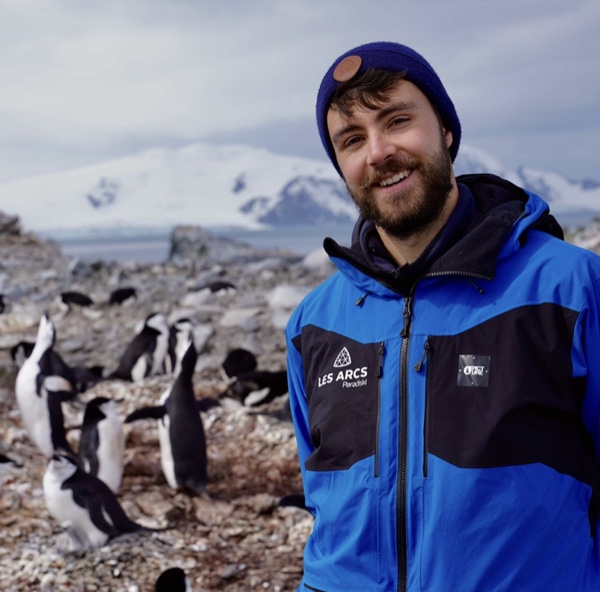



# About me

  

I am a postdoctoral researcher working on the <strong>atmospheric water cycle and water isotopes in polar regions</strong>, combining numerical modelling and field observations.

From <strong>November 2026</strong>, I will join the <a href="https://www.slf.ch/en/" target="_blank">WSL Institute for Snow and Avalanche Research SLF</a> in Davos (Switzerland) for a two-year postdoc with Benjamin Walter in the Snow Physics group, to model <strong>airborne snow metamorphism</strong> and its impact on the isotopic composition of polar snow. Until then, I am a postdoctoral researcher with <a href="https://mathieucasado.com/" target="_blank">Mathieu Casado</a> at the <a href="https://www.lsce.ipsl.fr/" target="_blank">Laboratory of Climate and Environmental Sciences</a> (LSCE, <a href="https://www.universite-paris-saclay.fr/en" target="_blank">Université Paris-Saclay</a>), where I study snow–vapour interactions during Antarctic atmospheric rivers and how these extreme events are archived in ice cores.

I also co-lead the <strong>water stable isotope working group</strong> of the <a href="https://www.antarctica-insync.org/" target="_blank">Antarctica InSync</a> initiative, with Sonja Wahl and Amy Macfarlane.

I completed my PhD in December 2025 at LSCE, entitled <em>Water vapour isotopes in Antarctica as tracers of boundary layer processes and large-scale dynamics</em>, under the supervision of <a href="https://cecileagosta.github.io/" target="_blank">Cécile Agosta</a> in <a href="https://www.lsce.ipsl.fr/en/archives-traceurs/glaccios/" target="_blank">Amaelle Landais' team</a>.

I graduated from the <a href="https://ens-paris-saclay.fr/en/" target="_blank">École Normale Supérieure de Paris-Saclay</a> and hold a master's degree in Geosciences from the <a href="https://www.ens.psl.eu/en/" target="_blank">École Normale Supérieure Ulm</a>.

  
  
Science communication is another area I’m really interested in. I co-created the popular science channel <a href="https://ordres-de-grandeur.com/" target="_blank">Ordres de grandeur</a> (<a href="https://www.instagram.com/ordres.de.grandeur/" target="_blank">Instagram</a>, <a href="https://www.tiktok.com/@ordresdegrandeur/" target="_blank">Tiktok</a>), where we explore orders of magnitude: those huge differences between the infinitely large and the infinitely small which contribute to a better understanding of the world. In October 2026, we published our first book, <a href="/outreach"><em>De la fourmi à la galaxie</em></a> (Vuibert).

  

 

  <a class="btn" href="/CV_ND_2026_english.pdf" download>Download my CV</a>
  <a class="btn btn-outline" href="/publications">Publications</a>

---

## Featured media

  

  <iframe src="https://www.youtube.com/embed/cpVs4qevVE8" title="Présentation de ma thèse - Les Chantiers de la recherche (France Culture)" frameborder="0" allow="accelerometer; autoplay; clipboard-write; encrypted-media; gyroscope; picture-in-picture" allowfullscreen></iframe>
  

  
<em>Presentation of my PhD work on "Les Chantiers de la recherche" (France Culture).</em>

---

# News

- **November 2026** : Starting a two-year postdoc at the [WSL Institute for Snow and Avalanche Research SLF](https://www.slf.ch/en/) (Davos, Switzerland) with Benjamin Walter, on the modelling of airborne snow metamorphism and its isotopic imprint on polar snow (SNSF-funded project).

- **October 2026** : Our book [***De la fourmi à la galaxie : 100 questions pour comprendre la vie, la Terre, l'infini et au-delà***](/outreach) (Vuibert), co-written with Baptiste Arnaud and Arthur Gublin from *Ordres de grandeur*, is out!

- **April 2026** : New preprint submitted to *JAMES*: [*Improving isotopic surface fluxes over snow in LMDZ6iso: evaluation at Dome C, East Antarctica*](https://doi.org/10.22541/essoar.15002511/v1). We implement fractionation during sublimation and a new formulation of surface condensation in LMDZ6iso, which improves the simulated diurnal cycle of vapour isotopes at Concordia.

- **February 2026** : My second first-author paper is published in [*The Cryosphere*](https://doi.org/10.5194/tc-20-1025-2026): *Water vapour isotope anomalies during an atmospheric river event at Dome C, East Antarctica*.

- **February 2026** : The *Water Isotope Model Intercomparison Project (WisoMIP)* paper, which I co-authored, is published in [*JGR: Atmospheres*](https://doi.org/10.1029/2025JD044985).

- **2 December 2025** : PhD defense at the [Laboratoire des Sciences du Climat et de l’Environnement (LSCE)](https://www.lsce.ipsl.fr/), Université Paris-Saclay. The thesis is available on [theses.fr](https://theses.fr/2025UPASJ023).

- **October 2025** : Appearance on the France Culture programme *Les Chantiers de la recherche* to present my PhD work.

Older news

- **June 2025** : Presented LSCE's polar research at the Cryosphere Pavilion of the UN Ocean Conference (UNOC) in Nice.

- **May 2025** : Co-led a session on **science communication and social media** as part of the *Best Practices Guide for Science Communication and Mediation* organized by the [Centre Climat-Société (C2S)](https://www.ipsl.fr/centre-climat-societe/). The session, titled *"Sensibiliser et agir sur les réseaux sociaux"*, took place on May 26 at IPSL (Jussieu). 

- **May 2025** : Participation in the [AARG Workshop on Atmospheric Rivers](https://aarg-workshop.sciencesconf.org/), held in Grenoble from May 5 to 8.

- **April 2025** : Participation in the [EGU 2025](https://www.egu25.eu/). I gave an oral presentation on May 1st during session AS1.22 ([abstract](https://meetingorganizer.copernicus.org/EGU25/EGU25-18530.html) and [presentation support](https://drive.google.com/file/d/1J2isjqr7QTLSp1IwDWniUulnF41hXVDM/view?usp=sharing)). 
  
- **February 2025** : New paper out [here](https://doi.org/10.1029/2024JD042073) in *JGR: Atmospheres*. In this article, I evaluate the LMDZ6iso global atmospheric model in Antarctica in relation to surface snow, precipitation and water vapor isotopic observations. 

- **January 2025** : Guest on the science communication radio show [*Fréquence Recherche*](https://www.radiocampusparis.org/emission/LAp-frequence-recherche#:~:text=Retrouvez%20Fr%C3%A9quence%20Recherche%20en%20direct,podcast%20sur%20Radio%20Campus%20Paris.) on January 9, 2025, alongside [Julien Bobroff](https://fr.wikipedia.org/wiki/Julien_Bobroff). The episode is available [here](https://www.radiocampusparis.org/emission/LAp-frequence-recherche/JNR9-recherche-et-vulgarisation-julien-bobroff-et-niels-dutrievoz).  

- **April 2024** : Participation in the [EGU 2024](https://www.egu24.eu/). I presented a poster ([abstract](https://meetingorganizer.copernicus.org/EGU24/EGU24-19539.html)) during Session AS1.19.

  


